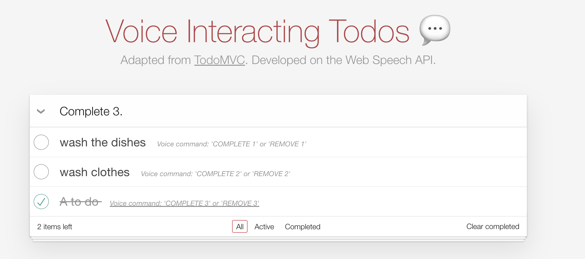

# Voice Interacting Todos

A simple **Todos app** that demos using your voice to interact with the addition, deletion, or resolution of a todo item.

It is powered by the Web Speech API, mainly the `SpeechRecognition` service embedded in the browser.

## Screenshot



## Quick start

```sh
npm install
npm run dev
```

## How it works

First, ask for the client's audio permission before starts.

```ts
const granted = await navigator.mediaDevices?.getUserMedia({
  audio: true,
});
console.log("granted: ", granted?.active);
```

Then, we use the `SpeechRecognition` API to initialize.

```js
const recognition = new SpeechRecognition();

recognition.continuous = true;
recognition.interimResults = false;
recognition.lang = "en-US";

recognition.onresult = (event) => {
  const lastTranscript = event.results[event.results.length - 1][0].transcript;

  console.log("lastTranscript: ", lastTranscript); // here is the user's voice last input text
};

recognition.start();
```

## Voice command keywords

- **ADD** `do something`: it will create a `do something` item
- **REMOVE** `index number`: it will delete the `index number` item
- **COMPLETE** `index number`: it will resolve the `index number` item

## Miscellaneous

The audio permission would only be granded over a secure **https** connection or in **localhost** environment. Otherwise, it would `NOT` work when you are in a **http** connection.

## Acknowledge

The **Todos app** code was adapted from the [Vue.js TodoMVC](https://vuejs.org/examples/#todomvc).
